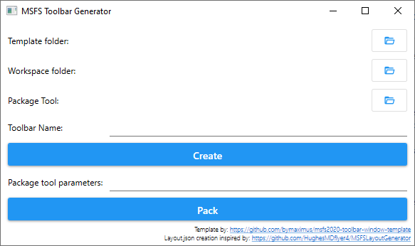

## Welcome

The toolbar generator is a small windows desktop application running on .net 5 which lets you create named toolbar templates to be further used to display content from an external (outside the simulator) source in an iframe.

### Requirements

- Windows with .net 5 runtime
- MSFS SDK
  - v1.0.0 is testet with the 0.9.0.0 steam version

### Installation
After downloading and unpacking the application from the link above or via the repository releases pages you should have the following:

- a "Template" folder
- and "MsfsToolbarGenerator.exe"

You can copy those wherever you want.

### Generate a toolbar

Template folder: Select the folder from the downloaded ZIP named "Template"

Workspace folder: Any empty folder will do for now

Package Tool: Select the package tool from the MSFS SDK

Toolbar Name: The Name of the toolbar. Please do not use "Space" or any special character for now ;-)

Create: Copies the template files to the workspace folder and renames them

Packagetool parameters: After "Create" this field will show the parameters used to call the package tool to build the toolbar. You may correct them now, but at your own responsibility!

Pack: Calls the package tool, waits for it to compile and copies the build artifacts to their respective places

### Link the toolbar to a website

Finally you need to tell the toolbar the URL to the content it should display.

- Open "html_ui\InGamePanels\YourFancyToolbarNamePanel\YourFancyToolbarNamePanel.js" with a editor
- Replace "http://localhost/index.html" at line 11 and 27 with your URL. Do keep the quotation marks while doing so!

If you are not sure if the URL you choose works in the simulator, you might create a simple local html page with an iframe and test it in your browser beforehand.

Keep in mind that only simple sites currently work within the sim. So dont try to add netflix ;-)

### Use it in the simulator

Just copy the whole workspace directory into your community folder and name it accordingly.

### What can go wrong

